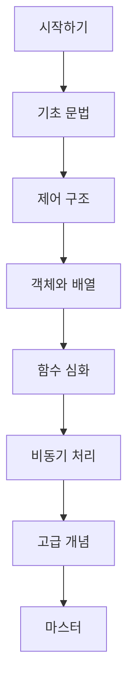

# JavaScript 교육 자료

> **체계적이고 포괄적인 JavaScript 학습을 위한 교육용 리소스 컬렉션**

## 개요

본 프로젝트는 JavaScript 프로그래밍 언어를 기초부터 고급 수준까지 체계적으로 학습할 수 있도록 설계된 교육용 자료 모음입니다. 인터랙티브 프레젠테이션, 상세 문서, 실습 퀴즈 등 다양한 형태의 학습 자료를 제공합니다.

## 프로젝트 구조

```
JavaScript-Education/
├── docs/              # 웹 기반 인터랙티브 프레젠테이션
│   ├── index.html        # 메인 프레젠테이션 (25개 슬라이드)
│   ├── script.js         # 네비게이션 및 상호작용 로직
│   └── styles.css        # 반응형 스타일 및 다크 테마
├── quiz/              # 단원별 학습 평가 퀴즈
│   ├── 01-tutorial.html  # 튜토리얼 퀴즈
│   ├── 02-intro.html     # JavaScript 소개 퀴즈
│   └── ...               # 기타 단원별 퀴즈
├── STUDY/             # 실습 프로젝트 및 예제
│   ├── 1/                # 기초 실습
│   ├── 2/                # 중급 실습
│   └── ...               # 고급 실습
└── README.md             # 프로젝트 가이드
```

## 학습 과정

### 기초 단계 (Foundation)
- **JavaScript 시작하기** - 언어 소개 및 개발 환경 설정
- **변수와 데이터 타입** - 기본 데이터 타입과 변수 선언
- **문자열 처리** - 문자열 조작 및 템플릿 리터럴
- **숫자 연산** - 수학 연산자 및 Math 객체
- **불린 로직** - 논리 연산 및 조건부 표현식

### 중급 단계 (Intermediate)
- **함수** - 함수 선언, 표현식, 화살표 함수
- **제어문** - 조건문, 반복문, 분기문
- **객체** - 객체 리터럴, 프로퍼티 접근, 메서드
- **배열** - 배열 메서드, 고차 함수, 배열 조작

### 고급 단계 (Advanced)
- **함수형 프로그래밍** - 클로저, 고차 함수, 순수 함수
- **비동기 처리** - Promise, async/await, 비동기 패턴
- **클래스** - ES6 클래스, 상속, 캡슐화
- **모듈 시스템** - ES6 모듈, import/export

## 사용 방법

### 인터랙티브 프레젠테이션
- **키보드 네비게이션**: `←/→` 또는 `Space/Shift+Space`
- **터치 네비게이션**: 모바일에서 좌우 스와이프
- **목차 네비게이션**: 사이드바에서 직접 슬라이드 이동
- **진행률 추적**: 상단 프로그레스 바로 학습 진도 확인

### 퀴즈 시스템
- **자동 채점**: 실시간 정답 확인
- **단원별 구성**: 각 주제별 맞춤 문제
- **즉시 피드백**: 오답 시 해설 제공

### 실습 프로젝트
- **단계별 실습**: 난이도별 프로젝트 구성
- **완성된 예제**: 참고용 완성 코드 제공
- **실무 중심**: 실제 개발에 적용 가능한 예제

## 기술 스택

| 분야 | 기술 |
|------|------|
| **Frontend** |    |
| **스타일링** | CSS Grid, Flexbox, CSS Variables |
| **문법** | ES2015+ (ES6, ES7, ES8) |
| **도구** | Vanilla JS (프레임워크 없음) |


## 온라인 데모

**[JavaScript 학습 가이드 - 라이브 데모](https://zk06-study.github.io/JavaScript_1.0/#title)**

> 웹 브라우저에서 바로 접속하여 인터랙티브 프레젠테이션을 체험할 수 있습니다.

## 학습 진도 추적



## 기여 방법

프로젝트 개선에 기여하고 싶으시다면:

1. **Fork** 이 리포지토리
2. **Branch** 생성 (`git checkout -b feature/amazing-feature`)
3. **Commit** 변경사항 (`git commit -m 'Add amazing feature'`)
4. **Push** 브랜치 (`git push origin feature/amazing-feature`)
5. **Pull Request** 생성
